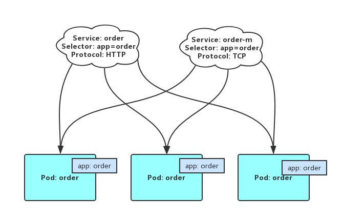

# 服务网格 Istio 简介


## 服务网格产生的背景

##### 容器技术的广泛应用

由于 Docker 的出现，容器技术得到更广泛的认可和应用，各种服务于容器的工具如雨后春笋般涌现，出现了众多服务于容器部署、容器集群、容器编排等的开源平台，例如 Swarm、Mesos、Kubernetes。由于容器的轻量级、启动速度快，性能损失小，扩容缩容快，开发生境环境统一等特性。越来越多的公司开始尝试使用容器来部署他们的服务。容器技术的飞速发展也大大加速了微服务的流行。

##### 微服务的快速流行

随着近几年云计算飞速发展，公有云也越来越成熟，云原生的概念被提及的越来越多，微服务架构模式在大公司兴起，特别是在 Netflix、亚马逊等公司的大规模实践，越来越多的公司开始尝试使用微服务架构来部署他们的应用。当微服务的服务数越来越多，微服务间服务通信也越来越重要，我们所看到一个应用，有可能背后需要协调成百上千个微服务来处理用户的请求。随着服务数和服务实例数的不断增长。服务可能上线下线，服务实例也可能出现上线下线和当机的情况，服务之间的通信也变得异常复杂，每个服务都需要自己处理复杂的服务间通信。

##### 目前服务架构中的痛

面对复杂的服务间通信问题，一般的解决方案是为服务开发统一的服务框架，所有服务依赖服务框架开发，所有服务间通信、服务注册、服务路由等功能都由底层服务框架来实现，这样做固然可以某种程度上解决服务间通信的问题，但是由于底层服务框架的限制，业务人员可能无法基于业务的实际情况选择合适的技术栈，由于所有服务都依赖于底层的服务框架代码库，当框架代码需要更新时，业务开发人员可能并不能立即更新服务框架，导致服务框整体架升级困难。后来 Netflix 开源了自己的微服务相关的处理服务间通信的组件，后面被 spring cloud 集成到了一起，组成了 java 语言的通用微服务技术栈，而其他编程语言可能并没有具有如此功能强大的开源组件，只能继续饱受微服务间通信中的各种痛。

基于以上服务间通信出现的问题，有人开始思考能不能把服务间的复杂通信分层并下沉到基础设施层去做，让应用无感知呢？答案是肯定的。于是服务网格开始渐渐浮出水面，越来越来的多人看到了服务网格 的价值。尝试把服务网格应用于实践。

## 服务网格是什么

#### 服务网格的定义

服务网格在英文被称为 service mesh，服务网格这个概念来源于 Buoyant 公司的 CEO Willian Morgan 的文章 [What’s a service mesh? And why do I need one?](https://blog.buoyant.io/2017/04/25/whats-a-service-mesh-and-why-do-i-need-one/)。服务网格是一个专注于处理服务间通信的基础设施层，它负责在由现代云原生应用组成的复杂的服务拓扑中可靠的传递请求，在实践中，服务网格通常被实现为一组随着应用代码部署的轻量级网络代理，与此同时，应用无须感知它的存在。

#### 服务网格的特点

- 轻量级的网络代理
- 应用无感知
- 应用之间的流量由服务网格接管
- 把服务间调用可能出现的超时、重试、监控、追踪等下沉到服务网格层处理

#### 为什么称为服务网格

如下图所示，绿色部分代表我们的应用，蓝色部分是服务网格中的轻量级网络代理组件，服务网络中的网络代理组件之间可以相互通信，我们的应用之间的通信完全由网络代理组件代理，如果只看网络代理组件部分，就组成一个网状结构，服务网格由此得名。


图片来自：[Pattern: Service Mesh](http://philcalcado.com/2017/08/03/pattern_service_mesh.html)

#### 服务网格架构

服务网格一般为由控制面（control plane）和数据面（data plane）组成，数据面负责服务间的请求代理，控制面负责服务之间的代理请求规则。基本架构如下图所示。


图片来自：[Pattern: Service Mesh

## Istio 功能

当服务网格的规模逐渐变大，复杂度上升，服务网格也变的越来越难理解和管理，这也就要求服务网格要包含基本的服务治理功能，例如：服务发现、负载均衡、故障转移、服务度量指标收集和监控等功能。目前，在主流的服务网格开源实现中，只有 Istio、Linkerd2（Conduit）功能最为完整。以 Istio 为例，主要实现了以下功能：

- 服务发现
- 服务路由
- 负载均衡
- 故障转移
- 安全加密
- 弹性服务
- 故障注入
- 日志监控
- 调用链追踪

基于以上功能我们还可以实现更复杂的功能，比如：A/B测试、金丝雀发布/灰度发布，服务请求速率限制，服务访问权限控制，端到端的用户验证等。

## Istio 架构

Istio 在逻辑上分为数据平面（data plane）和控制平面（control plane）

数据平面由一系列的部署为边车模式的智能代理组成，These proxies mediate and control all network communication between microservices. They also collect and report telemetry on all mesh traffic

Envoy 作为一个边车（sidecar）与对应的服务部署在同一个 Kubernetes pod 中


控制平面负责管理和配置代理来路由流量


Istio 的数据平面主要负责流量转发、策略实施与遥测数据上报，控制平面主要负责接受用户配置生成路由配置规则、分发路由规则到代理、分发策略与遥测数据收集。

Traffic in Istio is categorized as data plane traffic and control plane traffic. Data plane traffic refers to the messages that the business logic of the workloads send and receive. Control plane traffic refers to configuration and control messages sent between Istio components to program the behavior of the mesh. Traffic management in Istio refers exclusively to data plane traffic

Pilot 为 Envoy 提供服务发现功能，为智能路由（例如：A/B测试、金丝雀发布等）和弹性（例如：超时、重试、熔断器等）提供流量管理能力

Citadel 通过内置身份和凭证管理提供了强大的服务间和终端用户的认证。在服务网络中，你可以使用 Citadel 把不加密的通信升级为加密的通信 

Galley 负责代替 Istio 其他控制平面组件验证用户输入的 Istio API 配置

## 使用注意事项

### 服务使用 Istio 的要求

为了成为 service mesh 的一部分，部署在 Kubernetes 中的 service 和 pod 资源必须要满足如下的一些要求。

#### 使用命名端口

必须 service 的端口命名，而且命令的格式必须以协议开头，之后可以接中划线和其他字符，例如：http2-foo、http都是合法的命名方式，而 http2foo 不是合法的命令方式，协议支持 http、http2、grpc、mongo、redis。如果端口命名不符合上述规则或者没有使用命名端口，该端口上的流量将会被视为 TCP 流量，除非 service 里指明了协议使用 UDP。命名端口形式如下：

```yaml
kind: Service
apiVersion: v1
metadata:
  name: service-go
  labels:
    app: service-go
spec:
  selector:
    app: service-go
  ports:
    - name: http
      port: 80
```

#### 服务关联问题

如果一个 pod 属于多个 service，多个 service 将不能使用同一个端口，并设置多个不同的协议，例如：两个 service 选择了相同的后端 pod 实例，但是分别使用了 HTTP 和 TCP 协议，如下图所示：



#### 部署使用 app 和 version 标签

使用 Kubernetes 的 deployment 时，指定明确的 app 和 version 标签是非常推荐的。每个 deployment 都应该有一个有意义的唯一的 app 标签，并指定一个 version 标签用于指定应用的版本。 app 标签用于分布式调用链追踪， app 和 version 标签也会被用于 Istio 的度量指标收集。

## 请求完整链路分析
