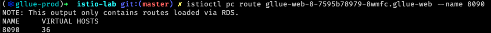
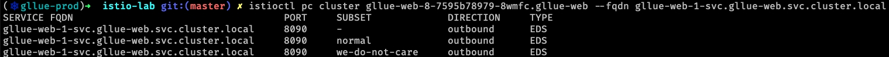
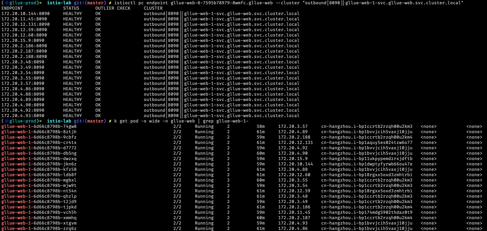
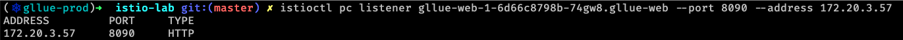

# 服务网格 Istio

---

**目录**

- [服务网格出现的背景](#/3)
- [服务网格简介](#/)
- [Istio 简介](#/)
- [Istio 的功能](#/)
- [Istio 的架构](#/)
- [Istio 对服务的要求](#/)
- [Istio 路由示例](#/)
- [请求完整链路分析](#/)

---

## 服务网格出现的背景

---

### 容器被广泛应用


- 轻量、启动速度快，性能损失小，环境统一等特性
- Docker 的出现，使容器技术得到更广泛的应用
- 容器编排工具 Kubernetes 被大量采用

---

### 微服务架构流行


- 云计算飞速发展，云原生的概念被提出
- 微服务架构模式在大公司的大规模实践
- 很多的公司开始尝试使用微服务架构

---

### 服务间通信


- 服务间通信复杂，超时、重试、限流
- 开发服务框架，处理服务间通信
- 业务开发技术栈受制于服务框架
- 服务框架版本升级困难

---


能不能把服务间的复杂通信下沉到基础设施层去做，让应用无感知呢？

---

## 服务网格简介

---

### 定义

服务网格(service mesh)概念来源于文章 [What’s a service mesh? And why do I need one?](https://blog.buoyant.io/2017/04/25/whats-a-service-mesh-and-why-do-i-need-one/)

服务网格是一个专注于处理服务间通信的基础设施层，它负责在由现代云原生应用组成的复杂的服务拓扑中可靠的传递请求，在实践中，服务网格通常被实现为一组随着应用代码部署的轻量级网络代理，与此同时，应用无须感知它的存在。

---

### 特点


- 轻量级网络代理
- 应用无感知
- 应用间流量由服务网格接管
- 超时、重试、监控、追踪等功能下沉到服务网格层

---

## Istio 简介

---


Sail（航行）

由 Goole、IBM、Lyft 公司主导的开源 service mesh 实现，使用 Go 语言编写

Connect, secure, control, and observe services

Notes:
Istio 的官方图标为一个白色的小帆船。

Istio 出自希腊语，发音类似于 ['ɪstɪəʊ]，表达的意思为英文的 “sail”，表示”航行“的意思。 

使用 Istio 可以让服务间的通信更简单，更安全，控制服务更容易，并使得观测服务更方便

---

## Istio 的功能

---

- 服务发现
- 服务路由
- 负载均衡
- 故障转移
- 安全加密
- 弹性服务
- 故障注入
- 日志监控
- 调用链追踪

基于以上功能可以实现更复杂的功能，比如：A/B 测试、金丝雀发布/灰度发布，权限控制

---

## Istio 的架构

---


Istio 在逻辑上分为数据平面（data plane）和控制平面（control plane）

---


数据平面由部署为边车模式的 Envoy 组成，负责流量转发、策略实施与遥测数据上报

Envoy 以边车（sidecar）的方式与服务部署在同一个 Kubernetes Pod 中，通过 iptables 规则来把所有网络流量（排除 127.0.0.1/8 网段）拦截到 Envoy 中

---


控制平面 istiod 负责接受用户配置，生成路由规则、分发路由规则到代理

- Pilot 提供服务发现功能和流量管理能力
- Citadel 提供服务间认证，通信加密
- Galley 负责用户输入规则的合规性校验

---

## Istio 对服务的要求

---

**使用命名端口**

Service 使用命名端口，命名必须以协议开头，之后可以接中划线和其他字符，例如：http2-foo、http。默认会被视为 TCP 流量

```yaml
kind: Service
apiVersion: v1
metadata:
  name: service-go
  labels:
    app: service-go
spec:
  selector:
    app: service-go
  ports:
    - name: http
      port: 80
```

---

**服务关联问题**

同一个 Pod 的相同端口不能使用不同的协议

---

**服务UID**

服务不能使用 UID 为 1337 用户运行，istio 会使用这个 UID 进行流量截持相关处理

---

**部署使用 app 和 version 标签**

给 Deployment 指定明确的 app 和 version 标签

```yaml
apiVersion: extensions/v1beta1
kind: Deployment
metadata:
  labels:
    app: gllue-web-1
    version: we-do-not-care
  name: gllue-web-1-wdc
spec:
  selector:
    matchLabels:
      app: gllue-web-1
      version: we-do-not-care
  template:
    metadata:
      labels:
        app: gllue-web-1
        version: we-do-not-care
```

---

## Istio 路由示例

---

**DestinationRule**

```yaml
apiVersion: networking.istio.io/v1alpha3
kind: DestinationRule
metadata:
  name: service-go
spec:
  host: service-go
  subsets:
  - name: v1
    labels:
      version: v1
  - name: v2
    labels:
      version: v2
```

---

**VirtualService**

```yaml
apiVersion: networking.istio.io/v1alpha3
kind: VirtualService
metadata:
  name: service-go
spec:
  hosts:
  - service-go
  http:
  - route:
    - destination:
        host: service-go
        subset: v1
      weight: 70
    - destination:
        host: service-go
        subset: v2
      weight: 30
```

---

## 请求完整链路分析

---

**Envoy 中的概念**


- LDS：监听器发现服务，服务实例的监听端口
- RDS：路由发现服务，路由流量到不同的集群中
- CDS：集群发现服务，服务实例的集群
- EDS：端点发现服务，单个服务实例地址

---

### HTTP 请求分析

---

#### 调用方发出请求

---

**DNS 解析**


---


```sh
istioctl pc listener gllue-web-8-7595b78979-8wmfc.gllue-web
```


---


---


---



---

```sh
istioctl pc route gllue-web-8-7595b78979-8wmfc.gllue-web --name 8090 -o json
```


---



---

```sh
istioctl pc cluster gllue-web-8-7595b78979-8wmfc.gllue-web --fqdn gllue-web-1-svc.gllue-web.svc.cluster.local -o json
```


---



---

**服务方接受请求**

---



---

```sh
istioctl pc listener gllue-web-1-6d66c8798b-74gw8.gllue-web --port 8090 --address 172.20.3.57 -o json
```


---


---

### End

谢谢
